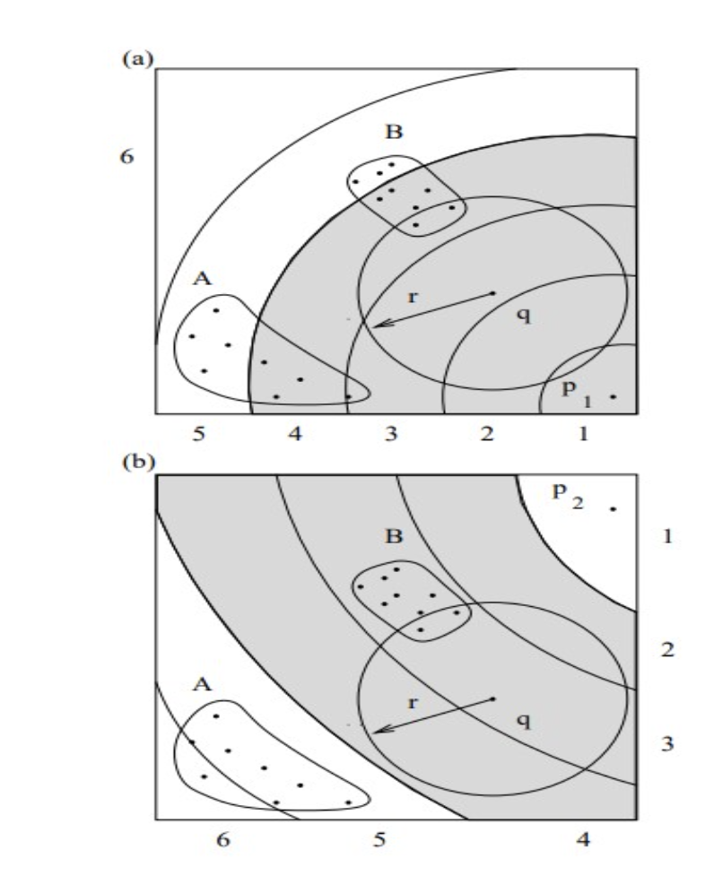
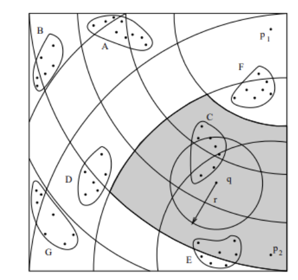
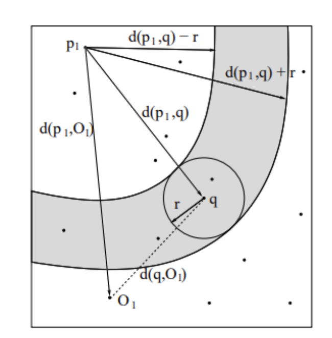

# M-Grid: A Metric Pseudo-Grid for High-Dimensional Similarity Search

This repository contains an implementation of the M-Grid indexing structure. The M-Grid is a novel access method designed for efficient similarity search in high-dimensional and metric data spaces.

## Overview

The M-Grid constructs a pseudo-grid structure in metric spaces using a set of pivot objects. The data points are approximated by their distances to these pivots, effectively mapping them onto a low-dimensional space. This allows clustering the data points based on their positions on the pseudo-grid. During similarity search, the M-Grid prunes clusters that cannot contribute to the query answer using the triangular inequality property, thus reducing the number of distance computations and disk accesses required.

## Images

(Cluster formation)
(Pruning of cluster)
(Triangular inequality theorem)

## Features

- Supports efficient nearest neighbor search in high-dimensional vector spaces and general metric spaces.
- Utilizes sequential disk accesses for improved I/O performance.
- Guarantees correct results by leveraging the properties of the pseudo-grid.
- Scales well with increasing dimensionality and the number of nearest neighbors retrieved.
- Supports dynamic insertions and deletions of data objects.

## Getting Started

### Prerequisites

- Python 3.x
- NumPy
- (Other required libraries)

### Installation

1. Clone the repository: git clone https://github.com/your-username/m-grid.git
2. Install the required dependencies: pip install -r requirements.txt

### Usage

1. Prepare your dataset in the appropriate format.
2. Initialize the M-Grid with your dataset and desired parameters.
3. Perform nearest neighbor queries using the provided functions.

Refer to the examples and documentation for more details on usage.

## Documentation

Detailed documentation and usage examples can be found in the [docs](docs/) directory.

## Contributing

Contributions are welcome! Please feel free to submit issues or pull requests for bug fixes, improvements, or new features.

## References

- Digout, C., & Nascimento, M. A. (2005). A metric pseudo-grid for high-dimensional similarity search. In Proceedings of the 21st International Conference on Data Engineering (ICDE 2005) (pp. 859-870). IEEE.

## License

This project is licensed under the [MIT License](LICENSE).
